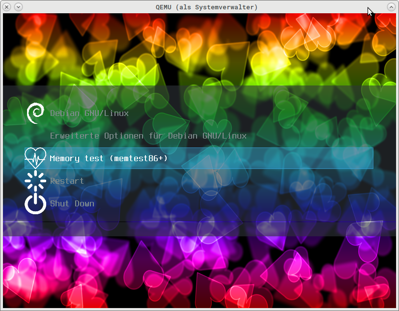

My debian grub2 theme, which complements the breeze theme by some points
1. an icon for memtest
2. icons for reboot and shutdown
3. an own bokeh background image
4. a bigger menu, so that all relevant entries are visible.

Put the files under `/boot/grub/themes/`, the `default.grub` file contains the additions for `/etc/default/grub`

For memtest to get an icon, the file `/etc/grub.d/20_memtest86+` must have `--class memtest` added to the line with the menuentry:

```
menuentry "Memory test (memtest86+)" --class memtest {
```

The entries for reboot and shutdown come from the file `40_custom`,
which has to be copied to `/etc/grub.d./`

`update-grub` activates the new theme and the boot entries - see screenshot.png.  
To preview/test your theme, use [grub2-theme-preview](https://github.com/hartwork/grub2-theme-preview)

The background was made with this bokeh tool:
https://codepen.io/ajm13/full/Bvczj

## everybody loves screenshots


